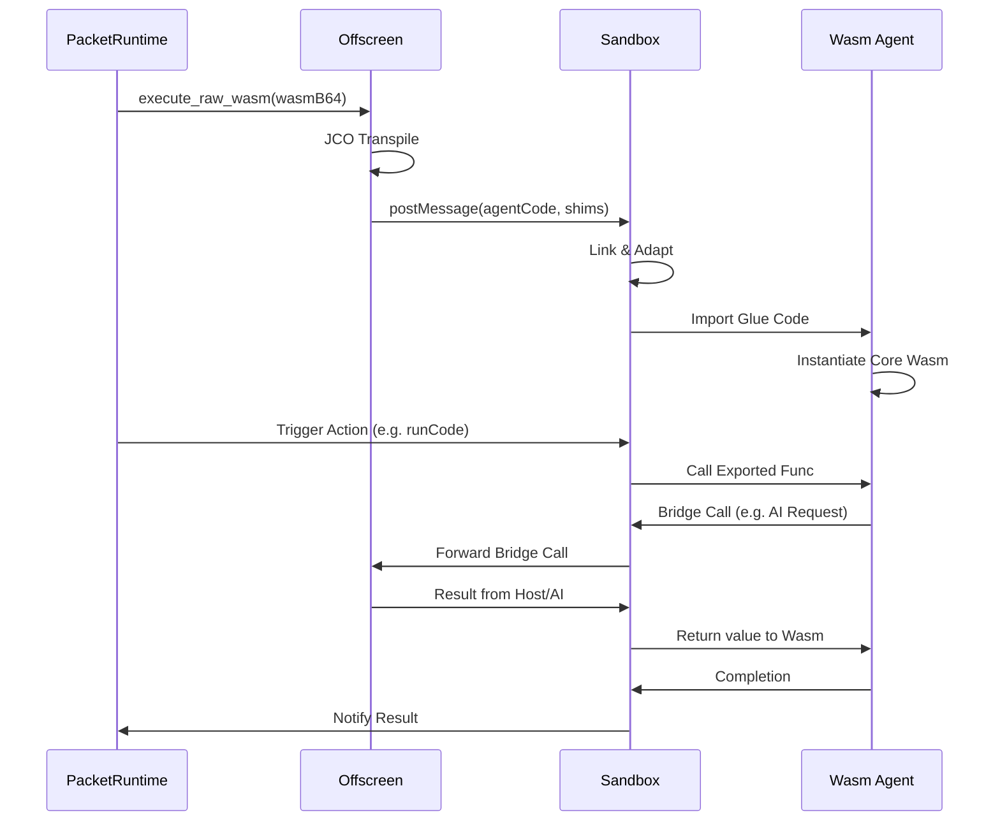

# Wasm Packet Execution Model

The execution model for Wasm packets in **Unlock** is a multi-stage process that bridges the gap between high-level **Wasm Components** and the browser's **Core Wasm** runtime, all while maintaining a secure sandbox.

## 1. Packet Structure (`packet.json`)
A packet is defined by a JSON manifest. For Wasm-based packets, this include:
- **`format`: "wasm"**: Identifying the content as a WebAssembly module.
- **`worldVersion`**: The WIT (Wasm Interface Type) version it adheres to (e.g., `"v1"`).
- **`sourceContent`**: Often contains the Wasm binary encoded as a Base64 string for portability.

## 2. Load and Transpilation (Offscreen)
Since browsers do not yet natively support Wasm Components (WIT), the extension uses the **JCO (JS Component Objects)** compiler.

1.  **Retrieval**: `PacketRuntime` fetches the Wasm binary from IndexedDB or the extension's assets.
2.  **Offscreen Handoff**: The binary is sent to `offscreen.js`.
3.  **JCO Transpilation**: `offscreen.js` uses JCO to break the Component into:
    *   **Core Wasm**: The compiled logic.
    *   **JS Glue Code** (`agent.js`): Generated code that handles WIT-to-JS type conversions and exports.
    *   **WASI Shims**: Standard implementations for `io`, `filesystem`, `clocks`, etc.

## 3. Sandboxed Linking (The Sandbox)
The transpiled assets are sent to a highly restricted `sandbox.html` iframe.

- **Dynamic Linking**: `sandbox.js` solves the "circular dependency" problem with `blob:` URLs by iteratively resolving imports.
- **Adapter Generation**: It generates "Dynamic Adapters" on-the-fly. If the agent imports `wasi:cli/stderr`, the sandbox creates a small shim module that maps this specific import to the broader `cli.js` shim.
- **Instantiation**: The `agent.js` module is imported, which in turn calls `WebAssembly.instantiate` to boot the core Wasm.

## 4. Execution Flow
Once instantiated, the execution follows this path:

## 5. Host Capabilities (The Bridge)
Wasm code can access extension capabilities through the **WIT Interface Layer**:
- **AI Access**: Requests for Gemini Nano are bridged from Wasm -> Sandbox -> Offscreen -> Chrome AI API.
- **UI Interaction**: The `host-ui` interface allows Wasm to push cards and status updates to the Sidebar.

This architecture ensures that while the logic is written in a language like Rust or Python (via QuickJS in Wasm), it executes with near-native speed and high security within the Chrome sandbox.
